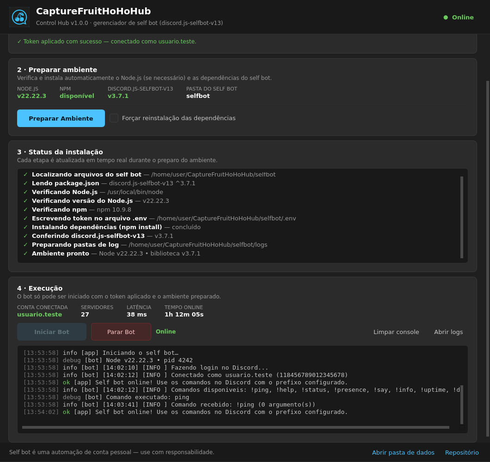

# CaptureFruitHoHoHub

**Self bot simples** (discord.js-selfbot-v13) + **aplicativo Windows (.exe) com interface dark** para instalar, configurar e executar tudo com poucos cliques.

<p align="left">
  
  
  
  
  
</p>



---

## ⚠️ Aviso importante (leia antes de usar)

- **Self bot viola os Termos de Serviço do Discord.** Automatizar uma conta de usuário pode resultar em **banimento permanente** da conta. Use somente em uma conta que você aceita perder, por sua conta e risco.
- Este projeto é **educacional**: demonstra integração Node.js + interface desktop, manipulação de processos e instalação automatizada de dependências.
- O token dá **acesso total à sua conta**. Nunca envie o token para ninguém, nunca faça commit dele e evite colá-lo em sites de terceiros. O aplicativo guarda o token apenas na sua máquina (`%LOCALAPPDATA%\CaptureFruitHoHoHub.ControlHub\settings.json` e `selfbot\.env`), com permissões restritas ao seu usuário.
- Você é o único responsável pelo uso deste software.

---

## 📦 O que tem neste repositório

| Pasta | O que é | Tecnologia |
| --- | --- | --- |
| [`selfbot/`](selfbot/) | O self bot em si: cliente, sistema de comandos, logs e protocolo de eventos. | Node.js + [discord.js-selfbot-v13](https://www.npmjs.com/package/discord.js-selfbot-v13) |
| [`manager/`](manager/) | O aplicativo Windows (**Control Hub**): tema dark, aplica o token, prepara o ambiente, inicia/para o bot e mostra o status em tempo real. | Python + PySide6 (Qt 6) → `.exe` via PyInstaller |
| [`docs/`](docs/) | Documentação complementar e capturas de tela. | — |

---

## ✨ Recursos

### Aplicativo (Control Hub)

- 🎨 **Interface nativa em tema dark** (estilo Fluent/WinUI), janela única e organizada.
- 🔑 **Aplicar Token** com validação de formato **e** verificação online na API do Discord (`/users/@me`), com feedback visual verde/amarelo/vermelho.
- 🧰 **Preparar Ambiente** automatizado:
  - localiza (ou **baixa e instala automaticamente**) o **Node.js LTS** sem precisar de instalador;
  - confere a versão mínima exigida pela biblioteca;
  - grava o token no `.env`;
  - executa `npm install` e confere a instalação de `discord.js-selfbot-v13`.
- 📋 **Painel de status em tempo real**: cada etapa com ícone e cor (`✓` verde, `◐` amarelo em andamento, `!` alerta, `✗` vermelho), com rolagem automática.
- ▶️ **Iniciar Bot** habilitado **apenas** com token aplicado **e** ambiente preparado; **Parar Bot** encerra a árvore de processos com segurança (`taskkill /T`).
- 🚦 **Indicador de status**: `Parado`, `Iniciando`, `Online`, `Erro` — mais métricas de conta, servidores, latência e tempo online.
- 🖥️ **Console de log** com cores por nível, gravação em arquivo (`%LOCALAPPDATA%\...\logs\manager-AAAA-MM-DD.log`) e botão para abrir a pasta de logs.
- 🛡️ **Tratamento de exceções**: sem Node.js, sem internet, token inválido, npm com erro, timeout de login — tudo reportado na interface em vez de quebrar.

### Self bot (Node.js)

- Compatível com os comandos: `!ping`, `!help`, `!status`, `!presence`, `!say`, `!info`, `!uptime`, `!del`.
- Presença (status + status personalizado), prefixo, filtro por servidor e cooldowns configuráveis via `.env`.
- Logs coloridos no terminal e em arquivo (`selfbot/logs/`).
- **Protocolo de eventos JSON** (`{"cfh":true,"event":...}`) no `stdout`, que é o que permite ao aplicativo mostrar o status real (online, latência, servidores, erros).
- Encerramento limpo por `stdin` (`stop`), `SIGINT`/`SIGTERM` ou pelo app.
- Códigos de saída semânticos para o app interpretar: `2` = token inválido, `3` = token recusado, `4` = falha de rede.

---

## 🚀 Como usar (versão `.exe`)

1. **Baixe/compile o aplicativo** (veja [Como compilar](#-como-compilar-o-exe)).
2. Execute `CaptureFruitHoHoHub-ControlHub.exe`.
3. **Cole o token** da conta no campo do cartão **1** e clique em **Aplicar Token**.
   - O campo fica mascarado; use **Mostrar** se precisar conferir.
   - Feedback: `✓ Token aplicado com sucesso — conectado como …` ou `✗ Token inválido …`.
4. Clique em **Preparar Ambiente** e acompanhe o painel **3 · Status da instalação**.
   - Sem Node.js instalado? O app baixa a versão LTS e instala na pasta de dados do usuário.
5. Com tudo verde, clique em **Iniciar Bot**. O indicador muda para **Iniciando → Online**.
6. No Discord, use o prefixo configurado (padrão `!`): `!ping`, `!help`, etc.

> Dica: rodando o `.exe` em uma pasta junto da pasta `selfbot/`, o app usa esses arquivos (útil para editar comandos). Sem a pasta, ele cria uma cópia própria em `%LOCALAPPDATA%\CaptureFruitHoHoHub.ControlHub\selfbot`.

### Como obter o token da conta

O token é o "crachá de acesso" da sua conta. Para obtê-lo:

1. Abra o **Discord no navegador** (ou o app desktop com `Ctrl + Shift + I` para abrir o DevTools).
2. Vá em **Application → Local Storage → `https://discord.com`** e localize a chave `token` (ou, na aba **Network**, observe o cabeçalho `Authorization` de qualquer requisição).
3. Copie **apenas o valor** (três partes separadas por ponto: `aaa.bbb.ccc`) e cole no campo do aplicativo.

> 🔒 Não use extensões/scripts de terceiros para "pegar o token": muitos roubam credenciais. E **nunca** compartilhe o token — quem tem o token tem a sua conta.

### Onde ficam os arquivos

| Caminho | Conteúdo |
| --- | --- |
| `%LOCALAPPDATA%\CaptureFruitHoHoHub.ControlHub\settings.json` | Token, caminho do Node.js e estado do ambiente |
| `%LOCALAPPDATA%\CaptureFruitHoHoHub.ControlHub\logs\` | Logs do aplicativo |
| `%LOCALAPPDATA%\CaptureFruitHoHoHub.ControlHub\selfbot\` | Cópia do self bot usada quando o `.exe` roda sozinho |
| `%LOCALAPPDATA%\CaptureFruitHoHoHub.ControlHub\runtime\node\` | Node.js portátil baixado automaticamente |
| `selfbot\.env` | Token + configurações do bot (nunca versionado) |
| `selfbot\logs\` | Logs do self bot |

---

## 🛠️ Como compilar o `.exe`

Pré-requisitos: **Windows 10/11**, **Python 3.10+** (marque *Add python.exe to PATH*). O Node.js **não** é necessário na máquina de build — o app instala no usuário final.

```powershell
cd manager

# Opção A — pasta de distribuição (recomendado, abre mais rápido)
.\build.ps1

# Opção B — arquivo único .exe (~60 MB)
.\build.ps1 -OneFile
```

Também é possível usar o atalho em lote:

```bat
build.bat            :: gera a pasta
build.bat --onefile  :: gera o .exe único
```

O script cria um ambiente virtual `.venv`, instala `PySide6` + `PyInstaller`, roda os testes de fumaça e chama o PyInstaller com [`CaptureFruitHoHoHub-ControlHub.spec`](manager/CaptureFruitHoHoHub-ControlHub.spec). Artefatos em `manager\dist\`.

Manualmente, se preferir:

```powershell
python -m venv .venv
.\.venv\Scripts\python -m pip install -r requirements.txt
.\.venv\Scripts\pyinstaller --noconfirm --clean CaptureFruitHoHoHub-ControlHub.spec
```

### Rodar sem compilar (modo desenvolvimento)

```bash
cd manager
python -m pip install -r requirements.txt
python app.py
```

### Testes

```bash
cd manager
python -m unittest discover -s tests -v
```

Os testes usam um Node.js/npm simulados e não precisam de internet nem do Discord.

---

## 🤖 Usando o self bot direto pelo Node (sem o app)

```bash
cd selfbot
cp .env.example .env      # Windows: copy .env.example .env
# edite o .env e preencha DISCORD_TOKEN
npm install
npm start
```

### Comandos disponíveis

| Comando | Aliases | Descrição |
| --- | --- | --- |
| `!ping` | `!latencia` | Latência do gateway |
| `!help` | `!ajuda`, `!comandos` | Lista os comandos |
| `!status <online\|idle\|dnd\|invisible>` | — | Altera a presença |
| `!presence <texto>` | `!atividade`, `!custom` | Status personalizado |
| `!say <texto>` | `!echo`, `!falar` | Envia uma mensagem |
| `!info` | `!userinfo`, `!conta` | Dados da conta conectada |
| `!uptime` | `!online` | Tempo de execução |
| `!del <1-20>` | `!limpar`, `!apagar` | Apaga suas últimas mensagens do canal |

### Configuração (`.env`)

| Variável | Padrão | Descrição |
| --- | --- | --- |
| `DISCORD_TOKEN` | — | **Obrigatório.** Token da conta (gravado pelo app) |
| `COMMAND_PREFIX` | `!` | Prefixo dos comandos |
| `STATUS` | `online` | `online`, `idle`, `dnd` ou `invisible` |
| `CUSTOM_STATUS_TEXT` | vazio | Texto do status personalizado |
| `SHOW_BANNER` | `true` | Banner inicial no terminal |
| `LOG_LEVEL` | `info` | `debug`, `info`, `warn` ou `error` |
| `LOG_TO_FILE` | `true` | Grava em `selfbot/logs/` |
| `ALLOWED_GUILD_IDS` | vazio | Lista de IDs de servidores onde os comandos funcionam |
| `RESPOND_TO_SELF` | `true` | Responde aos seus próprios comandos |
| `RESPOND_TO_OTHERS` | `false` | Responde comandos de outras pessoas |
| `HEARTBEAT_INTERVAL` | `30` | Intervalo (s) do evento de status enviado ao app (`0` desativa) |

---

## 🔄 Fluxo esperado do usuário

```
Abrir o .exe
   └─▶ Colar o token  ──▶  [ Aplicar Token ]  ──▶  ✓ Token aplicado com sucesso
                                     │
                                     ▼
                            [ Preparar Ambiente ]
                                     │
        ✓ Verificando Node.js… → ✓ Instalando dependências… → ✓ Ambiente pronto
                                     │
                                     ▼
                              [ Iniciar Bot ]  ──▶  Status: Iniciando → Online
                                     │
                                     ▼
                       No Discord: !ping  ──▶  🟢 Pong! Latência 42ms
```

---

## 🗂️ Estrutura do projeto

```
CaptureFruitHoHoHub/
├── selfbot/                       # Self bot (Node.js)
│   ├── index.js                   # Entrada: login, heartbeat, stdin/app
│   ├── package.json
│   ├── .env.example
│   └── src/
│       ├── config.js              # .env + validação de token
│       ├── logger.js              # logs coloridos + eventos JSON para o app
│       ├── client.js              # discord.js-selfbot-v13 + eventos
│       ├── commands.js            # comandos do bot
│       └── utils.js
├── manager/                       # Aplicativo Windows (Control Hub)
│   ├── app.py                     # Entrada do aplicativo
│   ├── requirements.txt
│   ├── build.ps1 / build.bat      # Compilação do .exe
│   ├── CaptureFruitHoHoHub-ControlHub.spec
│   ├── assets/                    # Ícones (.png/.ico)
│   ├── tests/test_smoke.py        # Testes (Node/npm simulados)
│   └── cfh_manager/
│       ├── paths.py               # Localização de pastas/self bot
│       ├── settings.py            # Token, .env e preferências
│       ├── workers.py             # Validação do token + preparo do ambiente
│       ├── bot_process.py         # Ciclo de vida do processo do bot
│       ├── theme.py               # Tema dark (QSS + paleta)
│       └── ui/
│           ├── main_window.py     # Janela principal
│           └── widgets.py         # Cartões, checklist, console
└── docs/screenshots/              # Capturas de tela
```

---

## ❓ Problemas comuns

| Sintoma | Causa provável / solução |
| --- | --- |
| `✗ Token inválido` | Token expirado/revogado, com o prefixo `Bot ` ou copiado incompleto. Gere um token novo. |
| `! Token salvo, mas não validado online` | Sem internet, proxy ou firewall bloqueando o Discord. O bot pode funcionar mesmo assim. |
| `Verificando Node.js: falha ao instalar automaticamente` | Sem conexão, proxy corporativo ou antivírus bloqueando. Instale o Node.js LTS manualmente e tente de novo. |
| `npm terminou com código ...` | Cache do npm corrompido: marque **Forçar reinstalação** e prepare novamente. |
| `O Discord não confirmou a conexão em 35 s` | Token inválido ou rede bloqueada (o app classifica o erro no console). |
| Janela não abre | Verifique se os arquivos da pasta `dist\...` estão completos (não mova só o `.exe`). |

---

## ⚖️ Licença

MIT — veja [`LICENSE`](LICENSE). O uso indevido (incluindo o descumprimento dos Termos de Serviço do Discord) é de responsabilidade exclusiva do usuário.
